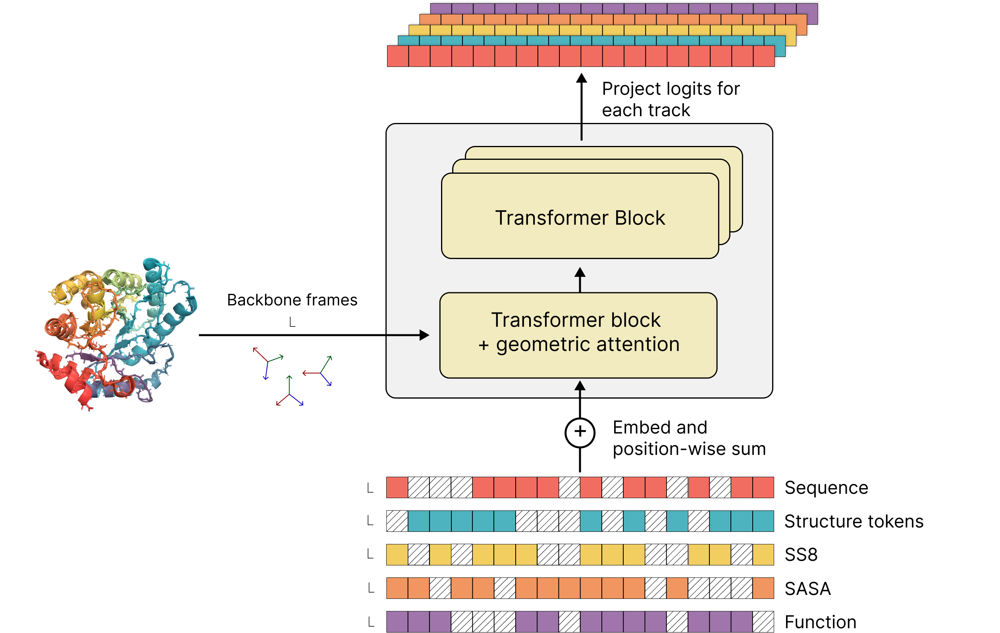

- [Installation ](#installation-)
- [ESM 3](#esm-3-)
  - [Quickstart for ESM3 Open](#esm3-quickstart-)
  - [ESM3 98B via Forge API](#esm3-forge)
  - [ESM3 Example Usage](#esm3-example-usage)
- [ESM C](#esm-c-)
  - [Quickstart for ESM C Open Models](#esm-c-open-)
  - [ESM C 6B via Forge API](#esm-c-forge-)
  - [ESM C via SageMaker for Commercial Use  ](#esm-c-sagemaker-)
  - [ESM C Example Usage](#esm-c-example-)
- [Responsible Development](#responsible-development-)
- [Licenses](#licenses-)
- [Citations  ](#citations-)


This repository contains flagship protein models for EvolutionaryScale, as well as access to the API. [ESM3](https://www.evolutionaryscale.ai/papers/esm3-simulating-500-million-years-of-evolution-with-a-language-model) is our flagship multimodal protein generative model, and can be used for generation and prediction tasks. [ESM C](https://www.evolutionaryscale.ai/blog/esm-cambrian) is our best protein representation learning model, and can be used to embed protein sequences.

## Installation <a name="installation"></a>

To get started with ESM, install the python library using pip:

```bash
pip install esm
```

## ESM 3  <a name="esm3"></a>

[ESM3](https://www.evolutionaryscale.ai/papers/esm3-simulating-500-million-years-of-evolution-with-a-language-model) is a frontier generative model for biology, able to jointly reason across three fundamental biological properties of proteins: sequence, structure, and function. These three data modalities are represented as tracks of discrete tokens at the input and output of ESM3. You can present the model with a combination of partial inputs across the tracks, and ESM3 will provide output predictions for all the tracks.

ESM3 is a _generative_ masked language model. You can prompt it with partial sequence, structure, and function keywords, and iteratively sample masked positions until all positions are unmasked. This iterative sampling is what the `.generate()` function does.

<!---->


The ESM3 architecture is highly scalable due to its transformer backbone and all-to-all reasoning over discrete token sequences. At its largest scale, ESM3 was trained with 1.07e24 FLOPs on 2.78 billion proteins and 771 billion unique tokens, and has 98 billion parameters.
Learn more by reading the [blog post](https://www.evolutionaryscale.ai/blog/esm3-release) and [the pre-print (Hayes et al., 2024)](https://www.evolutionaryscale.ai/papers/esm3-simulating-500-million-years-of-evolution-with-a-language-model).

ESM3-open, with 1.4B parameters, is the smallest and fastest model in the family.

### Quickstart for ESM3-open <a name="esm3-quickstart"></a>

```
pip install esm
```

The weights are stored on HuggingFace Hub under [HuggingFace/EvolutionaryScale/esm3](https://huggingface.co/EvolutionaryScale/esm3).

```py
from huggingface_hub import login
from esm.models.esm3 import ESM3
from esm.sdk.api import ESM3InferenceClient, ESMProtein, GenerationConfig

# Will instruct you how to get an API key from huggingface hub, make one with "Read" permission.
login()

# This will download the model weights and instantiate the model on your machine.
model: ESM3InferenceClient = ESM3.from_pretrained("esm3-open").to("cuda") # or "cpu"

# Generate a completion for a partial Carbonic Anhydrase (2vvb)
prompt = "___________________________________________________DQATSLRILNNGHAFNVEFDDSQDKAVLKGGPLDGTYRLIQFHFHWGSLDGQGSEHTVDKKKYAAELHLVHWNTKYGDFGKAVQQPDGLAVLGIFLKVGSAKPGLQKVVDVLDSIKTKGKSADFTNFDPRGLLPESLDYWTYPGSLTTPP___________________________________________________________"
protein = ESMProtein(sequence=prompt)
# Generate the sequence, then the structure. This will iteratively unmask the sequence track.
protein = model.generate(protein, GenerationConfig(track="sequence", num_steps=8, temperature=0.7))
# We can show the predicted structure for the generated sequence.
protein = model.generate(protein, GenerationConfig(track="structure", num_steps=8))
protein.to_pdb("./generation.pdb")
# Then we can do a round trip design by inverse folding the sequence and recomputing the structure
protein.sequence = None
protein = model.generate(protein, GenerationConfig(track="sequence", num_steps=8))
protein.coordinates = None
protein = model.generate(protein, GenerationConfig(track="structure", num_steps=8))
protein.to_pdb("./round_tripped.pdb")
```

Congratulations, you just generated your first proteins with ESM3!

### EvolutionaryScale Forge: Access to larger ESM3 models
 <a name="esm3-forge"></a>

You can access all scales of ESM3 models [EvolutionaryScale Forge](https://forge.evolutionaryscale.ai).

We encourage users to interact with the Forge API through the python `esm` library instead of the command line.
The python interface enables you to interactively load proteins, build prompts, and inspect generated proteins
with the `ESMProtein` and config classes used to interact with the local model.

In any example script you can replace a local `ESM3` model with a Forge API client:

```py
# Instead of loading the model locally on your machine:
model: ESM3InferenceClient = ESM3.from_pretrained("esm3_sm_open_v1").to("cuda") # or "cpu"
# just replace the line with this:
model: ESM3InferenceClient = esm.sdk.client("esm3-medium-2024-08", token="<your forge token>")
# and now you're interfacing with the model running on our remote servers.
...
```

and the exact same code will work.
This enables a seamless transition from smaller and faster models, to our largest and most capable protein language models for protein design work.

### ESM3 Example Usage
 <a name="esm3-example"></a>

Check out our [tutorials](./cookbook/tutorials) to learn how to use ESM3.

## ESM C <a name="esm-c"></a>
[ESM Cambrian](https://www.evolutionaryscale.ai/blog/esm-cambrian) is a parallel model family to our flagship ESM3 generative models. While ESM3 focuses on controllable generation of proteins, ESM C focuses on creating representations of the underlying biology of proteins.

ESM C is designed as a drop-in replacement for ESM2 and comes with major performance benefits. The 300M parameter ESM C delivers similar performance to ESM2 650M with dramatically reduced memory requirements and faster inference. The 600M parameter ESM C rivals the 3B parameter ESM2 and approaches the capabilities of the 15B model, delivering frontier performance with far greater efficiency. The 6B parameter ESM C outperforms the best ESM2 models by a wide margin.

ESM C can be run locally, via [the Forge API](https://forge.evolutionaryscale.ai/) or through [AWS SageMaker](https://aws.amazon.com/marketplace/seller-profile?id=seller-iw2nbscescndm).

### Quickstart for ESM C Open Models<a name="esm-c-open"></a>
When running the code below, a pytorch model will be instantiated locally on your machine, with the weights downloaded from the [HuggingFace hub](https://huggingface.co/EvolutionaryScale).
```py
from esm.models.esmc import ESMC
from esm.sdk.api import ESMProtein, LogitsConfig

protein = ESMProtein(sequence="AAAAA")
client = ESMC.from_pretrained("esmc_300m").to("cuda") # or "cpu"
protein_tensor = client.encode(protein)
logits_output = client.logits(
   protein_tensor, LogitsConfig(sequence=True, return_embeddings=True)
)
print(logits_output.logits, logits_output.embeddings)
```

To use Flash Attention with the open weights:

Simply install flash-attn package, which will enable Flash Attention automatically:
```
pip install flash-attn --no-build-isolation
```

You can also disable flash-attn by passing ``use_flash_attn=False`` to utils like ``ESMC_300M_202412``.

### ESM C 6B via Forge API <a name="esm-c-forge"></a>

Apply for access and copy the API token from the console by first visiting [Forge](https://forge.evolutionaryscale.ai).

With the code below, a local python client talks to the model inference server hosted by EvolutionaryScale.

```py
from esm.sdk.forge import ESM3ForgeInferenceClient
from esm.sdk.api import ESMProtein, LogitsConfig

# Apply for forge access and get an access token
forge_client = ESM3ForgeInferenceClient(model="esmc-6b-2024-12", url="https://forge.evolutionaryscale.ai", token="<your forge token>")
protein_tensor = forge_client.encode(protein)
logits_output = forge_client.logits(
   protein_tensor, LogitsConfig(sequence=True, return_embeddings=True)
)
print(logits_output.logits, logits_output.embeddings)
```

Remember to replace `<your forge token>` with your actual Forge access token.

### ESM C via SageMaker for Commercial Use  <a name="esm-c-sagemaker"></a>

ESM C models are also available on Amazon SageMaker under the [Cambrian Inference Clickthrough License Agreement](https://www.evolutionaryscale.ai/policies/cambrian-inference-clickthrough-license-agreement).
Under this license agreement, models are available for broad use for commercial entities.

You will need an admin AWS access to an AWS account to follow these instructions. To deploy, first we need to deploy the AWS package:

1. Find the ESM C model version you want to subscribe to. All of our offerings are visible [here](https://aws.amazon.com/marketplace/seller-profile?id=seller-iw2nbscescndm).
2. Click the name of the model version you are interested in, review pricing information and the end user license agreement (EULA), then click "Continue to Subscribe".
3. Once you have subscribed, you should be able to see our model under your [marketplace subscriptions](https://us-east-1.console.aws.amazon.com/marketplace/home#/subscriptions).
4. Click the product name and then from the "Actions" dropdown select "Configure".
5. You will next see the "Configure and Launch" UI. There are multiple deployment paths - we recommend using "AWS CloudFormation".
6. The default value for "Service Access" may or may not work. We recommend clicking "Create and use a new service role".
7. Click "Launch CloudFormation Template".  This takes 15 to 25 minutes depending on model size.
8. On the "Quick create stack" page, ensure the stack name and endpoint names are not already used. You can check existing stack names [here](https://console.aws.amazon.com/cloudformation/home/stacks) and existing endpoint names [here](https://us-east-1.console.aws.amazon.com/sagemaker/home?region=us-east-1#/endpoints).

The SageMaker deployment of the model now lives on a dedicated GPU instance inside your AWS environment, and will be billed directly to your AWS account.
Make sure to remember to shut down the instance after you stop using it. Find the CloudFormation stack you created [here](https://us-east-1.console.aws.amazon.com/cloudformation/home), select it, and then click "Delete" to clean up all resources.

After creating the endpoint, you can create a SageMaker client and use it the same way as a Forge client. They share the same API.
The local python client talks to the SageMaker endpoint you just deployed, which runs on an instance with a GPU to run model inference.

Ensure that the code below runs in an environment that has AWS credentials available for the account which provisioned SageMaker resources.  Learn more about general AWS credential options [here](https://docs.aws.amazon.com/cli/latest/userguide/cli-chap-authentication.html#cli-chap-authentication-precedence).

```py
from esm.sdk.sagemaker import ESM3SageMakerClient
from esm.sdk.api import ESMProtein, LogitsConfig

sagemaker_client = ESM3SageMakerClient(
   # E.g. "Endpoint-ESMC-6B-1"
   endpoint_name=SAGE_ENDPOINT_NAME,
   # E.g. "esmc-6b-2024-12". Same model names as in Forge.
   model=MODEL_NAME,
)

protein = ESMProtein(sequence="AAAAA")
protein_tensor = sagemaker_client.encode(protein)
logits_output = sagemaker_client.logits(
   protein_tensor, LogitsConfig(sequence=True, return_embeddings=True)
)
print(logits_output.logits, logits_output.embeddings)
```

### ESM C Example Usage
 <a name="esm-c-example"></a>

Check out our [tutorials](./cookbook/tutorials) to learn how to use ESM C.

## Responsible Development <a name="responsible-development"></a>

EvolutionaryScale is a public benefit company. Our mission is to develop artificial intelligence to understand biology for the benefit of human health and society, through partnership with the scientific community, and open, safe, and responsible research. Inspired by the history of our field as well as [new principles and recommendations](https://responsiblebiodesign.ai/), we have created a Responsible Development Framework to guide our work towards our mission with transparency and clarity.

The core tenets of our framework are

- We will communicate the benefits and risks of our research
- We will proactively and rigorously evaluate the risk of our models before public deployment
- We will adopt risk mitigation strategies and precautionary guardrails
- We will work with stakeholders in government, policy, and civil society to keep them informed

With this in mind, we have performed a variety of mitigations for `esm3-sm-open-v1`, detailed in our [paper](https://www.evolutionaryscale.ai/papers/esm3-simulating-500-million-years-of-evolution-with-a-language-model)

## Licenses  <a name="licenses"></a>

The code and model weights of ESM3 and ESM C are available under a mixture of non-commercial and permissive commercial licenses. For complete license details, see [LICENSE.md](./LICENSE.md).

## Citations  <a name="citations"></a>
If you use ESM in your work, please cite one of the following:

#### ESM3
```
@article {hayes2024simulating,
	author = {Hayes, Thomas and Rao, Roshan and Akin, Halil and Sofroniew, Nicholas J. and Oktay, Deniz and Lin, Zeming and Verkuil, Robert and Tran, Vincent Q. and Deaton, Jonathan and Wiggert, Marius and Badkundri, Rohil and Shafkat, Irhum and Gong, Jun and Derry, Alexander and Molina, Raul S. and Thomas, Neil and Khan, Yousuf A. and Mishra, Chetan and Kim, Carolyn and Bartie, Liam J. and Nemeth, Matthew and Hsu, Patrick D. and Sercu, Tom and Candido, Salvatore and Rives, Alexander},
	title = {Simulating 500 million years of evolution with a language model},
	year = {2024},
	doi = {10.1101/2024.07.01.600583},
	URL = {https://doi.org/10.1101/2024.07.01.600583},
	journal = {bioRxiv}
}
```

#### ESM C
```
@misc{esm2024cambrian,
  author = {{ESM Team}},
  title = {ESM Cambrian: Revealing the mysteries of proteins with unsupervised learning},
  year = {2024},
  publisher = {EvolutionaryScale Website},
  url = {https://evolutionaryscale.ai/blog/esm-cambrian},
  urldate = {2024-12-04}
}
```

#### ESM Github (Code / Weights)
```
@software{evolutionaryscale_2024,
  author = {{EvolutionaryScale Team}},
  title = {evolutionaryscale/esm},
  year = {2024},
  publisher = {Zenodo},
  doi = {10.5281/zenodo.14219303},
  URL = {https://doi.org/10.5281/zenodo.14219303}
}
```
